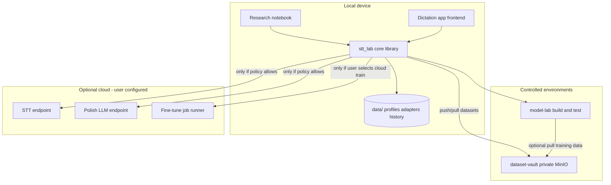
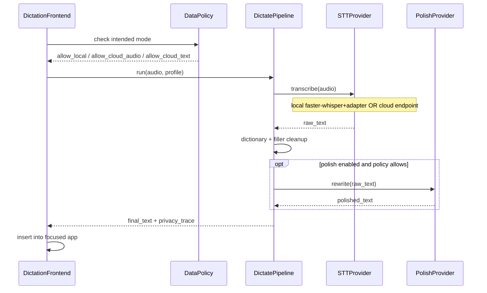
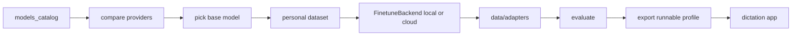

# STT Lab — Architecture

Status: draft  
Last updated: 2026-08-03  
Source of truth for product intent: [`PRODUCT_REQUIREMENTS.md`](PRODUCT_REQUIREMENTS.md)

## 1. Goals

Refine the system so that:

- The **frontend is always local**
- **STT / polish / training compute** may be local or cloud
- **Models and data residency** are fully user-configurable
- The **research lab** and **dictation app** share one core library and one profile format

## 2. System context



Nothing in the public cloud is required for a complete loop. **model-lab** and **dataset-vault** are first-party environments you run (Docker today; same vault client works against private S3 later).

## 3. Logical components

| Component | Responsibility | Location |
|---|---|---|
| **Dictation frontend** | Hotkey, mic, waveform UI, paste/insert, privacy indicator | Local app (to build) |
| **Research UI** | Catalog, compare, datasets, train, evaluate | `notebooks/` |
| **Core library** | Providers, pipeline, policy, profiles, metrics, fine-tune | `stt_lab/` |
| **Profile store** | Runnable configs (model + data policy + endpoints) | `data/profiles/` |
| **Artifact store** | Adapters, datasets, run history | `data/` |
| **model-lab** | Isolated build/test/fine-tune compute | `envs/model-lab` + compose |
| **dataset-vault** | Private encrypted object store for voice datasets | `envs/` MinIO service |
| **Cloud STT** | Remote transcription | User endpoint / BYO key |
| **Cloud polish** | Optional rewrite | User endpoint / BYO key |
| **Cloud train** | Remote LoRA job | Modal / HF Jobs / RunPod (future) |

### 3.1 Target package layout

```text
stt_lab/
  providers/           # STT backends (local whisper, cloud APIs, adapted)
  services/            # compare, evaluate, audio, local LoRA job
  finetune_backends.py # local | cloud training entrypoints
  policy.py            # data residency / what may leave device
  pipeline.py          # dictate path: STT → cleanup → optional polish
  profiles.py          # runnable profile load/save
  models.py            # shared schemas
  db.py                # datasets + fine-tune job metadata
  config.py            # env + paths

apps/dictation/        # future local frontend (Swift or Tauri)
notebooks/             # research UI
envs/
  model-lab/           # Docker image + entrypoint for build/test
  model_lab/           # CLI (smoke, finetune)
  docker-compose.yml   # model-lab + dataset-vault
data/
  profiles/            # *.json runnable profiles
  adapters/            # LoRA adapters
  datasets/            # local working copies of voice datasets
  history/             # optional dictation history (policy-gated)
```

### 3.2 Environment contracts

**model-lab**
- Purpose: reproducible place to install heavy ML deps, run compare smokes, fine-tune
- Interface: `python -m envs.model_lab.cli ...`
- Mounts repo; writes adapters/runs back into `data/`

**dataset-vault**
- Purpose: secure hosting of voice↔transcript objects (not the dictation hot path)
- Interface: S3 API via `stt_lab.vault` (`push_dataset` / `pull_dataset`)
- Defaults: private bucket, SSE-S3, no anonymous access
- Local working copies stay in `data/datasets/`; vault is source of truth when enabled


## 4. Runtime pipeline (dictation)

One pipeline interface; backends are swapped by profile.



### 4.1 Pipeline stages

1. **Capture** (frontend only) — mic buffer, VAD optional later  
2. **Policy gate** — deny cloud stages if profile forbids  
3. **Transcribe** — `STTProvider.transcribe(path) -> text`  
4. **Local cleanup** — dictionary / filler rules (always on-device)  
5. **Polish** (optional) — local or cloud LLM  
6. **Emit** — text + `PrivacyTrace` (what left the device)

### 4.2 Provider contracts

```text
STTProvider
  id, name, location: local|cloud
  ready() -> (bool, reason?)
  transcribe(audio_path, language?) -> Transcript

PolishProvider
  id, location: local|cloud|off
  polish(text, style?) -> text

FinetuneBackend
  name: local|cloud
  start(job) -> None   # updates job row / adapter artifacts
```

Local and cloud STT must be interchangeable behind `STTProvider`.

## 5. Data policy (first-class)

Policy is evaluated **before** any network call.

| Flag | Meaning |
|---|---|
| `allow_cloud_audio` | Raw audio may leave device |
| `allow_cloud_transcript` | Text may leave device (e.g. cloud polish after local STT) |
| `store_audio_locally` | Keep clips in history/datasets |
| `store_transcript_locally` | Keep text history |
| `retention` | `forever` \| `days:N` \| `none` |

Derived modes:

| Profile mode | allow_cloud_audio | allow_cloud_transcript | STT location | Polish location |
|---|---|---|---|---|
| `fully_local` | false | false | local | off or local |
| `hybrid_local_stt` | false | true/false | local | cloud optional |
| `cloud_stt` | true | true/false | cloud | off/local/cloud |

Invalid combos (e.g. cloud STT + `allow_cloud_audio=false`) are rejected at profile validation time.

## 6. Runnable profiles

A **profile** is the unit the dictation app loads. The lab exports it after research.

```json
{
  "id": "personal-whisper-small-lora",
  "name": "My voice / small LoRA",
  "mode": "fully_local",
  "stt": {
    "provider": "adapted",
    "base_model": "small",
    "adapter_id": "1c9e7fb8c0af41c8b25753101c0d5d47",
    "language": "en"
  },
  "polish": { "provider": "off" },
  "cleanup": {
    "filler_words": true,
    "dictionary_path": "data/profiles/personal-dict.json"
  },
  "policy": {
    "allow_cloud_audio": false,
    "allow_cloud_transcript": false,
    "store_audio_locally": true,
    "store_transcript_locally": true,
    "retention": "days:30"
  },
  "cloud": {
    "stt_base_url": null,
    "stt_api_key_env": null,
    "polish_base_url": null
  }
}
```

Cloud example differences:

```json
{
  "mode": "cloud_stt",
  "stt": { "provider": "openai_compatible", "model": "whisper-1" },
  "policy": { "allow_cloud_audio": true, "allow_cloud_transcript": true },
  "cloud": {
    "stt_base_url": "https://api.openai.com/v1",
    "stt_api_key_env": "OPENAI_API_KEY"
  }
}
```

Keys stay in env / OS keychain; profiles only reference env var names.

## 7. Research lab architecture

Current flow (unchanged responsibilities, clearer boundaries):



- **Compare** uses the same `STTProvider` registry as dictation  
- **Train** uses `FinetuneBackend` (`local` implemented, `cloud` stub)  
- **Export profile** is the handoff artifact (to implement)

## 8. Dictation frontend architecture

Frontend is a thin shell:

1. Load active profile  
2. Show privacy badge from policy (`Local` / `Cloud audio` / `Cloud text`)  
3. On hotkey: record → call local core (`pipeline.run`) over:
   - in-process Python (dev), or  
   - local sidecar RPC (prod), or  
   - FFI to a packaged runtime  
4. Insert returned text via OS accessibility / clipboard paste  

**Decision (working default):** Mac-first **Tauri or Swift** UI + **Python sidecar** hosting `stt_lab.pipeline` for MVP speed of reuse. Revisit if packaging cost is too high.

The frontend never embeds vendor cloud SDKs as the only path; it talks to core, and core applies policy.

## 9. Cloud boundaries

| Concern | Local path | Cloud path |
|---|---|---|
| STT | faster-whisper / adapted PEFT | OpenAI-compatible or provider SDK via `providers/cloud.py` |
| Polish | future local LLM | user OpenAI-compatible chat endpoint |
| Train | `services/finetune.py` thread | `finetune_backends.CloudFinetuneBackend` → job runner |
| Secrets | `.env` / keychain | same, never committed |
| Network | none | only after policy allow |

BYO endpoints only — no mandatory STT Lab hosted SaaS for core transcription.

## 10. Mapping to current code

| Now | Becomes |
|---|---|
| `providers/*` | STTProvider implementations (keep) |
| `services/transcribe.py` | Used by compare + pipeline STT stage |
| `services/finetune.py` + `finetune_backends.py` | Training plane (keep; flesh out cloud) |
| `notebooks/helpers.py` | Research façade over core |
| _(missing)_ | `policy.py`, `pipeline.py`, `profiles.py` |
| _(missing)_ | `data/profiles/`, dictation app |

## 11. Implementation phases

1. **Core contracts** — policy, pipeline, profiles in `stt_lab` (library-only)  
2. **Lab export** — notebook helper `export_profile(...)`  
3. **Dictation MVP** — local frontend + sidecar; local STT + cloud STT toggle  
4. **Polish stage** — optional  
5. **Cloud train** — Modal/HF Jobs writing into `data/adapters/`  

## 12. Architectural invariants

1. No feature may remove the fully local path.  
2. No network I/O without a passed policy check.  
3. Dictation UX must not fork between local and cloud (same hotkey/pipeline).  
4. Profiles are portable JSON; adapters are content-addressed under `data/adapters/`.  
5. Research and dictation share providers — no second STT stack.

---

When code and this document disagree, update the document or the code in the same change.
